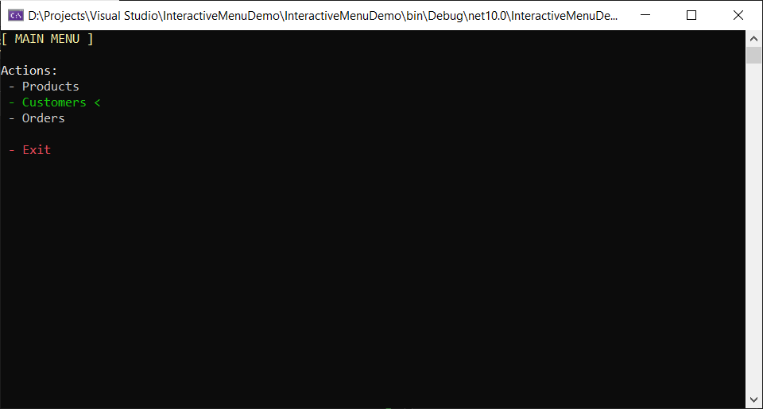
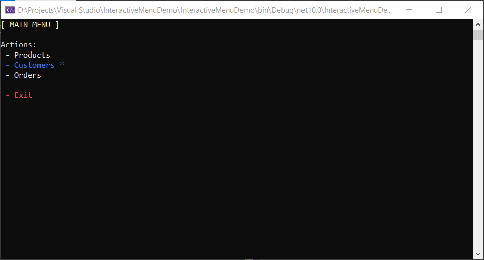

# InteractiveMenu


# Description

**InteractiveMenu** is a lightweight C# library for creating interactive console menus with navigation, selection, and
customizable appearance.

# Installation

**Install InteractiveMenu via NuGet:**

```
dotnet add package InteractiveMenu
```

**Or reference it directly in your .csproj:**

```
<PackageReference Include="InteractiveMenu" Version="1.0.0" />
```

# Usage Example

**Usings:**

```csharp
using InteractiveMenu.Items;
using InteractiveMenu.Core;
using InteractiveMenu.Configuration;
```

## Example #1. Minimal usage:

**Code:**

```csharp
Menu menu = new Menu();
MenuRenderer renderer = new MenuRenderer();
MenuController controller = new MenuController(renderer);

List<MenuItem> items = new List<MenuItem>()
{
    new TextItem("[ MAIN MENU ]") { Color = ConsoleColor.Yellow },
    new EmptyItem(),
    new TextItem("Actions:") { Color = ConsoleColor.White },
    new OptionItem(" - Products", 0),
    new OptionItem(" - Customers", 'c'),
    new OptionItem(" - Orders", "orders"),
    new EmptyItem(),
    new ActionItem(" - Exit", () => Environment.Exit(0)) { Color = ConsoleColor.Red },
};

menu.AddRange(items);

object? result = controller.Run(menu);

switch (result)
{
    case 0:
        ShowProducts();
        break;

    case 'c':
        ShowCustomers();
        break;

    case "orders":
        ShowOrders();
        break;

    default:
        GoToPreviousMenu();
        break;
}
```

**Output:**



## Example #2. Advanced usage:

**Code:**

```csharp
MenuOptions options = new MenuOptions()
{
    DefaultColor = ConsoleColor.White,
    SelectedColor = ConsoleColor.Blue,
    Selector = " *"
};

MenuKeyBindings bindings = new MenuKeyBindings()
{
    KeyCancelSet = new HashSet<ConsoleKey>() { ConsoleKey.Escape, ConsoleKey.Q },
    KeySelectSet = new HashSet<ConsoleKey>() { ConsoleKey.Enter, ConsoleKey.E },
};

MenuRenderer renderer = new MenuRenderer(options);
MenuController controller = new MenuController(renderer, bindings);

Menu menu = new Menu();

List<MenuItem> items = new List<MenuItem>()
{
    new TextItem("[ MAIN MENU ]") { Color = ConsoleColor.Yellow},
    new EmptyItem(),
    new TextItem("Actions:") { Color = ConsoleColor.Gray},
    new OptionItem(" - Products", 0),
    new OptionItem(" - Customers", 'c'),
    new OptionItem(" - Orders", "orders"),
    new EmptyItem(),
    new ActionItem(" - Exit", () => Environment.Exit(0)) { Color = ConsoleColor.Red },
};

menu.AddRange(items);

object? result = controller.Run(menu);

switch (result)
{
    case 0:
        ShowProducts();
        break;

    case 'c':
        ShowCustomers();
        break;

    case "orders":
        ShowOrders();
        break;

    default:
        GoToPreviousMenu();
        break;
}
```

**Output:**



# Components:

# Core:

## Menu

Provides a menu container with navigation and selection logic.

### Properties:

-   `Items` - Gets the list of menu items.
-   `SelectedIndex` - Gets the index of the selected item.

### Constructors:

-   `Menu()` - Initializes a new empty menu.
-   `Menu(params MenuItem[] items)` - Initializes a new menu with items.

### Methods:

-   `Add(MenuItem item)` - Adds a menu item.
-   `AddAt(int index, MenuItem item)` - Adds a menu item at the specified index.
-   `AddRange(params MenuItem[] items)` - Adds multiple menu items.
-   `AddRange(IEnumerable<MenuItem> items)` - Adds multiple menu items.
-   `AddRangeAt(int index, params MenuItem[] items)` - Adds multiple menu items at the specified index.
-   `AddRangeAt(int index, IEnumerable<MenuItem> items)` - Adds multiple menu items at the specified index.
-   `ReplaceAt(int index, MenuItem item)` - Replaces the item at the specified index.
-   `ReplaceRange(int start, int end, params MenuItem[] items)` - Replaces a range of items.
-   `RemoveFirst(int count)` - Removes the first items.
-   `RemoveLast(int count)` - Removes the last items.
-   `RemoveAt(int index)` - Removes the item at the specified index.
-   `RemoveRangeByCount(int index, int count)` - Removes a range of items starting at the specified index.
-   `RemoveRangeByIndices(int start, int end)` - Removes a range of items between indices.
-   `Clear()` - Removes all items.

## MenuController

Controls menu execution and user interaction.

### Constructors:

-   `MenuController(MenuRenderer renderer)` - Initializes a new instance of MenuController with a renderer.
-   `MenuController(MenuRenderer renderer, MenuKeyBindings bindings)` - Initializes a new instance of MenuController
    with a renderer and key bindings.

### Methods:

-   `Run(Menu menu)` - Runs the menu loop and returns the selected result.

## MenuRenderer

Provides rendering of menu items in the console.

### Constructors:

-   `MenuRenderer()` - Initializes a new instance of MenuRenderer with default options.
-   `MenuRenderer(MenuOptions options)` - Initializes a new instance of MenuRenderer with specified options.

# Configuration

## MenuOptions

Defines appearance options for menu rendering.

### Properties:

-   `DefaultColor` - Gets or sets the color for non-selected items. (`ConsoleColor.Gray` by default)
-   `SelectedColor` - Gets or sets the color for selected items. (`ConsoleColor.Green` by default)
-   `IsShowSelector` - Gets or sets a value indicating whether a selector symbol is shown. (`true` by default)
-   `Selector` - Gets or sets the symbol used to mark the selected item. (` <` by default)

### Constructors:

-   `MenuOptions()` - Initializes a new instance of MenuOptions with default values.

## MenuKeyBindings

Defines key bindings for menu navigation and selection.

### Properties:

-   `KeyUp` - Gets or sets the set of keys for moving up. (`W`, `UpArrow` by default)
-   `KeyDown` - Gets or sets the set of keys for moving down. (`S`, `DownArrow` by default)
-   `KeySelect` - Gets or sets the set of keys for selecting an item. (`Enter` by default)
-   `KeyCancel` - Gets or sets the set of keys for canceling or exiting. (`Escape` by default)

### Constructors:

-   `MenuKeyBindings()` - Initializes a new instance of MenuKeyBindings with default keys.

# Items

## MenuItem

Provides the abstract base class for all menu items.

### Properties:

-   `Text` - Gets the display text.
-   `Color` - Gets the foreground color.

### Constructors:

-   `MenuItem(string text)` - Initializes a new instance of MenuItem.

## TextItem : MenuItem

Provides a menu item that displays static text.

### Constructors:

-   `TextItem(string text)` - Initializes a new instance of TextItem.

## EmptyItem : MenuItem

Provides a menu item that renders empty space.

### Properties:

-   `Count` - Gets the number of empty lines.

### Constructors:

-   `EmptyItem()` - Initializes a new instance of EmptyItem with one empty line.
-   `EmptyItem(int count)` - Initializes a new instance of EmptyItem with a specified count.

## OptionItem : MenuItem, ISelectable

Provides a selectable menu item that returns an associated value.

### Properties:

-   `Value` - Gets the value associated with this option.

### Constructors:

-   `OptionItem(string text, object value)` - Initializes a new instance of OptionItem with text, value, and color.

## ActionItem : MenuItem, ISelectable

Provides a menu item that executes a delegate when selected.

### Constructors:

-   `ActionItem(string text, Delegate action)` - Initializes a new instance of ActionItem with a delegate.

# Supports

-   .NET 10.0
-   .NET 8.0

# License

InteractiveMenu is licensed under the MIT License.
